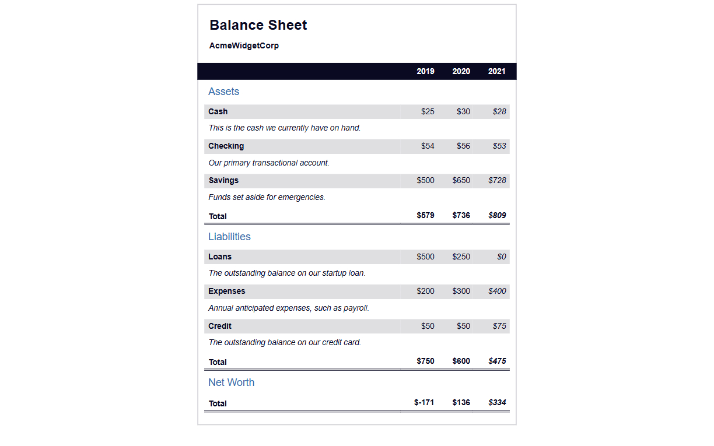

# Balance Sheet | FCC Responsive Web Design Certification

**Project 11/20**

A responsive and accessible balance sheet layout for AcmeWidgetCorp. This project organizes financial data using semantic HTML tables, styled with pure CSS. The design mimics real-world financial reports and includes assets, liabilities, and net worth over three years.

---

## 📚 Table of Contents

- [🔎 Overview](#-overview)
  - [📸 Screenshot](#-screenshot)
  - [🔗 Links](#-links)
  - [📌 Features](#-features)
- [🧠 My process](#-my-process)
  - [🛠️ Built with](#️-built-with)
  - [🎓 What I learned](#-what-i-learned)
  - [🔙 Previous Project](#-previous-project)
  - [🔜 Next Project](#-next-project)
- [👤 Author](#-author)
  - [🌐 Connect with Me](#-connect-with-me)
  - [💻 Coding Profiles](#-coding-profiles)

---

## 🔎 Overview

### 📸 Screenshot

### 🔗 Links

 - [🔴 Live Demo](https://dalascript.github.io/balance-sheet/)
 - [🗂️ GitHub Repository](https://github.com/DalaScript/balance-sheet)

### 📌 Features

 - ✅ Semantic HTML tables for structured financial data
 - ✅ Visually hidden labels for accessibility (`.sr-only`)
 - ✅ Responsive layout with sticky year header
 - ✅ Hover effect on totals
 - ✅ Description hints under each table row
 - ✅ Consistent column width and clean alignment

## 🧠 My Process

### 🛠️ Built with

 - HTML5
 - CSS3
 - Accessibility-first approach

### 🎓 What I Learned

 - How to organize large datasets with HTML tables
 - Using sticky headers for better readability
 - Styling financial content with consistent spacing and alignment
 - Improving accessibility with screen reader-only text
 - Creating responsive layouts without frameworks

  > 🚀 For me, this project was more about **practice** and gaining additional **experience**,  
  > rather than learning something entirely new.  
  >  
  > 👨‍💻 Since I’m not a beginner and already familiar with these technologies,  
  > I approached it with confidence — and still, I truly **enjoyed working on it**.  
  >  
  > 🎯 Overall, I consider this a very **valuable and enjoyable experience**.

### 🔙 Previous Project

 - Tribute Page *(Certification Project)* | *[Project 10/20]* → [View Repository](https://github.com/DalaScript/tribute-page)

### 🔜 Next Project

 - Cat Painting | *[Project 12/20]* → [View Repository](https://github.com/DalaScript/cat-painting)

---

## 👤 Author

### 🌐 Connect with Me

 - [Instagram](https://www.instagram.com/DalaScript)
 - [YouTube](https://www.youtube.com/@DalaScript)

### 💻 Coding Profiles

 - [freeCodeCamp](https://www.freecodecamp.org/DalaScript)
 - [FrontendMentor](https://www.frontendmentor.io/profile/DalaScript)
 - [GitHub](https://github.com/DalaScript)

*🙌 Thanks for checking out my project! More coming soon. Stay tuned 🚀*